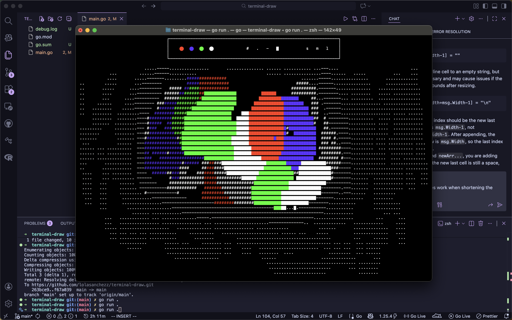

<h1>terminal draw!</h1>
<h3>a little ascii drawing app in the terminal</h3>

 just click and drag to draw! click on any of the icons to change your brush. the color circles change your brush color, the characters change your brush character, and the letters change your brush size (small, medium, large). the c clears your canvas. 

<h1>running</h1>
you can either install it as a go project, or download the binary on the side (compiled for macos arm).
